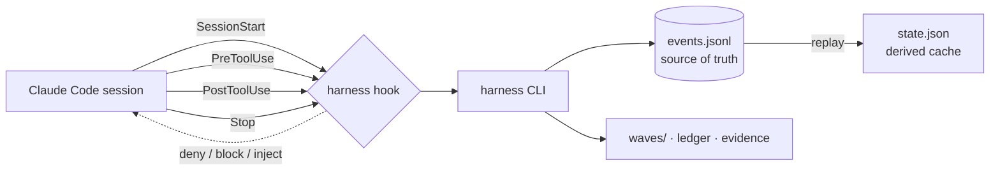

<!-- LANG-SWITCH -->
[English](README.md) · [한국어](README.ko.md) · **日本語** · [中文](README.zh.md)

# king-wjang-harness

> **AIエージェントは、どんな指示にも屁理屈をつけて逃げ道を作れる。だが、フックからは逃げられない。**

AIコーディングエージェントのためのプロセス規律 —— **フックによって強制される。プロンプトによって示唆されるのではない。** king-wjang-harness は **Design → Build → Ship** ライフサイクルを*不可侵*にする。エージェントが設計フェーズ中にソースコードを書こうとしたり、作業を未決着のままセッションを終えようとすると、ツール呼び出しを物理的に拒否する。説得はしない。「お願いだから覚えておいて」もない。**モデルの外側**で動く決定論的なゲートだ。

<sub>フック + CLI ・ 追記専用イベントジャーナルを信頼できる情報源として使用 ・ セッションあたりコンテキスト ~240 トークン ・ オプトインしていないプロジェクトでは無音</sub>

---

## 30秒でわかる要点

どのチームも自分たちのAIエージェントにプロセスを教え込む —— *まず設計し、テストを書き、作業を終える前に決着をつける。* それを `CLAUDE.md` に書き、スキルに書き、システムプロンプトに書く。

そして、プレッシャーがかかると、モデルは**自分でその指示を丸め込んでしまう**: 「この変更はシンプルだから設計ドキュメントは省略しよう」。「もう手動でテスト済みだ」。指示はあくまで助言であり、それに従うかどうかを決めるのはモデル自身だ —— 判決に利害関係を持つ裁判官のようなものだ。

**強制の問題は、より良い指示では解決できない。** モデルが制御できないゲートが必要だ。

king-wjang-harness はそのゲートだ。エージェントが**設計トラック**にいる状態で `src/app.ts` を編集しようとすると、`PreToolUse` フックが `deny` を返す —— 編集は決して実行されない。コミットされていない作業とターンログ未更新のままセッションを終えようとすると、`Stop` フックが `block` を返す。モデルは戻り値に反論できない。

---

## スキル vs. フック —— 何が違うのか

これが重要な指標だ。「どちらのツールが速いか」ではなく —— **規律がスタックのどの層に存在するか**だ。

| | プロンプト / スキル / `CLAUDE.md` <br>*(助言的)* | **king-wjang-harness** <br>*(強制的)* |
|---|---|---|
| **メカニズム** | モデルが読み、従うかどうかを*選択する*テキスト | フックが `deny` / `block` を返す —— モデルの**外側**で下される決定 |
| **モデルは無視できるか？** | できる —— プレッシャー下で屁理屈をつける | **できない** —— ツール呼び出しが物理的に止められる |
| **負荷時の信頼性** | 最も重要な瞬間にこそ劣化する | 一定 —— 戻り値は疲れない |
| **コンテキストコスト** | ルールを追加するたびに増大する | **セッションあたり ~240 トークンで一定** —— ルールはプロセス外で動くので、増やしても増えない |
| **失敗モード** | サイレントなドリフト。後になって気づく | 可観測 —— スキップは必ず痕跡を残す |
| **状態** | ステートレス。毎セッション再説明が必要 | 永続的なイベントジャーナル。`/clear`・再開・マシン変更を生き延びる |

> **競合ではなく補完だ。** [superpowers](https://github.com/obra/superpowers) のようなスキルライブラリは、モデルを*働き方について賢く*する。king-wjang-harness は*プロセスそのものを不可侵*にする。両方使え —— スキルが提案し、フックが決定する。

**各条件1回ずつ試しただけで、ベンチマークではない。** 方法論（モデル・課題文・試行回数）を記録していないので、測定ではなく逸話として読んでほしい: 同一タスクをこなす2体のエージェント（ハーネスをブートストラップし、UXエビデンスゲートを通過してウェーブを完了させる）:
- **ハーネスのガイダンスなし** → エージェントはエビデンスゲートに突き当たり、バイパスフラグの推測を試し尽くした末、**作業を未完了のまま放置した**。
- **ハーネスあり** → すべてのステップを完了し、ゲートから正しく回復した。

ゲートこそが要点だ。ガイダンスだけでは突破できない。強制された契約だけが突破できる。

---

## 動作の仕組み



- **イベントジャーナルが信頼できる情報源だ。** `.harness/events.jsonl` は追記専用。`state.json` は*派生キャッシュ*であり —— 壊れても削除してもジャーナルを再生することでハーネスが再構築する。`harness doctor --repair` はまさにこれを行う。
- **3つのトラック、13のフェーズ。** Design `P0–P6` ・ Build `P7–P9` ・ Ship `P10–P12`。
- **4つのフック、1つのバイナリ:**
  - `SessionStart` —— 現在のフェーズ、アクティブなウェーブ、そのウェーブの指示、直近のターンログ、そして劣化警告があれば注入する。エージェントは自分がどこにいるかを正確に把握した状態で起動する。
  - `PreToolUse` —— 設計トラックでのソース書き込み、設計トラックでのデプロイ系 Bash、そして**どのフェーズでも**ハーネス管理下の3ファイルへの手編集を拒否する。
  - `PostToolUse` —— 「実際の作業が行われた」（書き込み / 自分以外の Bash）ことを記録し、Stop ガードがターンの決着が必要だと判断できるようにする。
  - `Stop` —— アクティブなウェーブに活動があったのにターンログが更新されていない場合、セッション終了をブロックする（明示的な「これは些細な変更だった」の一行報告は、認められた抜け道だ）。
- **ウェーブと設計台帳。** *ウェーブ*とは、ターンログと受け入れ基準を持つ作業単位だ。*台帳（ledger）*はバージョン付きの設計ノードを保持する。`node bump` は変更された設計を参照していたすべてのウェーブに **STALE** を伝播させる —— 古くなった決定の上に何かがひそかに積み上がることはない。

---

## デザインシステムと Claude Design 🎨

ハーネスは**設計を強制され、バージョン管理された状態**として扱う —— そして Claude Design はその視覚的なフロントエンドだ。この一部はすでに出荷済みで、深い統合は次のマイルストーンだ。以下が正直な内訳だ。

### 現在（v0）: UX 証跡ゲート

`UX-` ノードを参照するウェーブは、`.harness/evidence/<wave-id>/` に視覚的な成果物がなければ**完了させることができない**。Claude Design でモックアップをプロンプトし、HTML/PNG をエクスポートし、エビデンスフォルダに置く —— それでゲートが開く。モックアップがなければ完了もない。**実際に描かれたことのないUX機能を出荷することはできない。**

### Claude Design 連携 — ネットワーク pull を除いて出荷済み

*（この節の見出しは元は「ロードマップ」だった。静かな方向に間違っていた —— キャンバスの自動取得を除く以下すべては実装・実測済みである。過小広告もまた文書の欠陥だ。ただ誰も文句を言わないだけである。）*

- **キャンバス = 視覚的な信頼できる情報源。** 1つのアートボード ↔ 1つのUXノード（`"UX-7 Checkout"`）。キャンバスのURLは設計台帳に保持される。 **未出荷:** キャンバスをネットワーク経由で取得すること —— `harness design sync <UX-x> --from <file>` は自分で書き出した内容を受け取る。
- **`harness design sync`** はキャンバスを取得し、承認済みハッシュと差分を取り、変更があれば**ノードのバージョンを上げ → STALE を伝播させる。** キャンバスの編集は*正式な設計改訂*になる —— 下流のすべてのビルドウェーブが自動的にフラグされる。
- **P4 抽出**はコンポーネント一覧と2倍解像度のベースラインPNGを取得し、後の視覚回帰レビューに使用される。
- **フィードバックループ:** キャンバスのコメントスレッドが（`harness gate feedback` によって）改訂として収集される —— チャット不要の、iPadでの「レビュー → コメント → 改訂 → 再提出」ループ。

### デザインシステムの規律: 1つのトークンファイルがトーンを支配する

**不変条件: プロダクトの視覚的トーン全体は、単一のトークンファイルの関数である。**

- 機能コードに生の値は存在しない —— セマンティックトークンのみ。`text.primary` ✅ ・ `blue.500` ❌。
- ソースは1つ（`design-tokens.json`）。CSS変数、TS定数、Tailwind設定はすべて*生成される*ものであり、手でコピーされることは決してない。
- トークン → プリミティブ → ベースコンポーネント → ドメインコンポーネントという4層システムで、各層は `DS-*` 台帳ノードだ。承認後、ディレクトリは**凍結**され、コンポーネントが野放図に増殖することはない。
- **三重の強制**（フック層は**既定で off** —— `config.yaml` で有効化する）**:** lint（生の値 = CI 赤）+ フック（トークンファイル外の色/スペーシングのリテラルは拒否される）+ **トークンスワップ訓練**（テーマを入れ替え、全画面をスクリーンショット —— ハードコードされた画面だけが変化せず、即座に露呈する）。

> 見返りはこの不変条件そのものだ: **1つのファイルを編集するだけでプロダクト全体を再テーマ化できる** —— それを約束ではなく、スクリーンショット訓練で証明する。

---

## 保証（実際に守っている不変条件）

- **非干渉** —— `.harness/` ディレクトリが*ない*プロジェクトでは、すべてのフックが沈黙を返す。グローバルにインストールしてもリスクはゼロ。**プロジェクト単位**で、`harness init` の後にのみ有効化される。
- **無害** —— フックは**決してセッションをクラッシュさせない。** すべての内部エラーは `exit 0` に吸収されログに記録される。壊れた判定は沈黙に劣化するのであって、セッションの死には至らない。
- **決定論的** —— 判定経路のどこにも壁時計時刻も乱数もない。同じ入力 → 常に同じ判定。（同一条件でのテスト実行3回にわたって検証済み。）
- **可観測なフェイルオープン** —— ハーネスが*実際に*沈黙するとき、`.harness/.runtime/hook-errors.log` に痕跡を残す。`harness doctor` がそれをカウントし、表面化させる。観測されないフェイルオープンは、無いより悪い。
- **インジェクション対策済み** —— ウェーブのフロントマターとターンログのテキスト（*過去*のセッションによって書かれたもの）は信頼できない入力として扱われる。それが指示チャネルに入る前に必ずサニタイズされる —— 改行は無害化され、制御文字は除去され、抜粋はコンテンツハッシュのノンスフェンスで包まれる。これにより、偽造されたログが脱出してハーネスの指示になりすますことはできない。
- **自己完結** —— ビルド済みの `core/dist/` はコミットされており、素の clone だけでビルドステップなしに動作する。`yaml` はインラインでバンドルされている。`npm audit --omit=dev`: **脆弱性0件。**

### 実測値

| 指標 | 値 |
|---|---|
| フックレイテンシ (p95) | インプロセス **2.6 ms**・10万件（15 MB）ジャーナル再生フォールバックで **18.9 ms**。フックは独立した `node` プロセスなので、エンドツーエンドではマシンの Node 起動が加わる —— この環境では実時間 133 ms / 162 ms で、そのうち **99 ms が `node` の起動**である。実時間の絶対値は本ツールではなくマシンの性質だ。 |
| テストスイート | **1236件 パス**（53ファイル）— うち16件はリポジトリ専用の検査で、配布物ではskipされる（配布物では1220件） |
| セッションあたりの追加コンテキスト | ハーネス有効時 **~240トークン**・`.harness/` の無いプロジェクトでは **0** |
| ランタイム依存 | **1件**（`yaml`、バンドル済み） |
| 決定性 | 3回の実行で判定が完全一致 |

**自分で測り直せる** —— `npm run bench:hook` がパッケージに同梱されている。10万件のジャーナルを
3つの形（現実・破損・敵対的）で合成し、実際のフックプロセスを計測して、**この機械の `node` 起動の
下限値**も併記する —— 絶対値の大部分はその下限であって、このツールではないからだ。

---

## 誰のためのものか

- *コードの前に設計*が実際に行われることを望むチーム —— 単に書き記されるだけでなく。
- テストの実行、作業の決着、実施内容の記録を「忘れる」エージェントにうんざりしている人。
- 視覚的エビデンスを伴って出荷しなければならないUX作業（ハーネスはこれをウェーブ完了のゲートにする）。
- **セッションの引き継ぎ**が重要になる長期プロジェクト —— ジャーナルが記憶そのものなので、新しいセッション（あるいは別のマシン）が、前回終えたところから正確に引き継げる。

---

## クイックスタート

### インストール（Claude Code プラグインとして）

```bash
claude plugin marketplace add <this-repo>
claude plugin install king-wjang-harness@king-wjang-harness
```

このプラグインは4つのフックすべてを自動配線する。`core/dist/` がコミットされているため、clone しただけで動く —— **ビルドステップ不要。**

<details>
<summary>ソースから（開発用）</summary>

```bash
npm install          # prepare hook builds core/dist via tsup
./bin/harness --version
```
</details>

### 使い方 —— ユーザーの席から

**基本的にはプロンプトを送るだけでいい。** ハーネスはエージェントを*通して*働く —— CLIを代わりに操作してくれて、フックがルールを強制する。コマンドを覚える必要はない。

```
あなた:      「ログイン機能を作ろう」
エージェント: （設計トラック P0 にいると認識）設計ノードを登録し、ウェーブを開始し、
        設計ドキュメントを書く —— だが src/ にはまだ触れられない（フックが拒否する）。
        「設計ドラフトができました。確認してください」
あなた:      「いいね —— 実装して」
エージェント: ビルドトラックに進み、src/ を実装し、終了前に
        ターンログを決着させる。
```

あなたの能動的な役割は**意思決定のポイント**にある —— 設計を承認し、設計からビルドへ移るタイミングを決める。*どうやるか*（CLIの配線やルール遵守）は、エージェントとフックの仕事だ。

> ターミナルでも Claude デスクトップアプリでも同一に動作する —— 同じエンジン、同じフック。

### コマンドリファレンス

| コマンド | 内容 |
|---|---|
| `harness init` | `.harness/` ステートストアを作成する（ここでフックが有効化される） |
| `harness status` | 現在の状態をJSONで出力する |
| `harness phase set <P0..P12>` | フェーズを切り替える —— **承認されたゲートだけが次を開く** |
| `harness node upsert --id <id> --title <t> [--status …]` | 設計台帳ノードを upsert する |
| `harness node bump <id>` | ノードを改訂する → `version++`、参照元ウェーブに STALE を伝播 |
| `harness wave create --goal <g> [--milestone m] [--refs a,b] [--accept c]` | ウェーブを開く → その id を出力する（`--goal` は必須） |
| `harness wave activate <wave-id>` | ウェーブをアクティブ化する |
| `harness wave update "<did / next>"` | ターンログを決着させる |
| `harness wave complete` | ウェーブを完了する（UXを参照するウェーブは視覚的エビデンスが必須） |
| `harness backtrack <phase> --reason "…"` | 後続トラックから設計へ正式に差し戻す |
| `harness doctor [--repair [--force]] [--accept-policy]` | 整合性チェック ・ ジャーナル再生による復旧 ・ ポリシー変更の検知（`--accept-policy` は `HARNESS_ACCEPT_POLICY=1` が必要 — 人間のみ） |

`harness --help` がコマンドマップを、`harness <グループ> --help` がそのグループのサブコマンドを表示する。このテーブルは簡易リファレンスだ。フックイベント（`harness hook …`）はプラグインが呼び出すものであり、手で呼ぶことはない。

---

### MCP ツール —— シェルなしで同じエンジン

プラグインは MCP サーバーも登録する。エージェントは `Bash` の代わりに型付きツール呼び出しで
ハーネスを操作できる。サーバーが公開するツールはちょうど16個だ: `harness_status`、
`harness_wave_create`・`_activate`・`_update`・`_complete`・`_list`、`harness_node_upsert`・`_bump`、
`harness_gate_submit`・`_status`、`harness_report_rtm`・`_hub`、`harness_ship_verdict`、
`harness_trace`、`harness_doctor` — そして `harness_gate_approve` は**拒否してターミナルを指す**
ためだけに存在する。

**意図的にできないこと が二つ**: ゲートの承認はできない（最終クリックは常に人間だ §4-3）し、
未承認ゲートを越えてフェーズを進めることもできない。MCP でできることは CLI でもできたことだけだ ——
ゲートは同じゲートである。

---

## 設定 — `.harness/config.yaml`

すべてのキーは任意で、ファイルが無ければ以下の既定値が使われる。
`design_*`・`block_raw_values` の 4 キーは **フックが何をブロックするかの入力** である。
ブロックがスタックに合わないときに触るのはソースではなくここだ。

| キー | 既定値 | 役割 |
|---|---|---|
| `lang` | `en` | ハーネス自身が出力する文言の言語 — CLI・フック JSON・生成ドキュメント。**MCP のツール説明と拒否文は英語のまま**（ko 文字列が MCP バンドルに無い）。日本語環境では `ko`（韓国語）も選べる。 |
| `profile` | `generic` | `test`・`build`・`deploy`・`e2e` コマンドの供給元プロファイル。プロジェクトローカルの `.harness/profile/` が常に優先。 |
| `remote_control` | `true` | SessionStart でリモート制御を案内するか。 |
| `terse` | `false` | フック案内を短くする。 |
| `design_allowed_prefixes` | `['.harness/', 'docs/']` | **設計トラックで実装コードを書ける場所。** この接頭辞の外の**ソースファイル**は P6 ゲート承認まで拒否される —— テスト・設定・ドキュメントはこの規則では止まらない。 |
| `design_blocked_bash` | デプロイ系コマンド（`npm publish`・`docker push`・`terraform apply` …） | **出荷トラックが開くまでブロックされるデプロイ系コマンド。** 部分文字列一致のため末尾フラグは書かない。スタック固有はプロファイルの `deploy_commands` が担う。 |
| `design_system_frozen_roots` | `[]` | 凍結後にデザインシステムファイルを変更してはいけないディレクトリ。 |
| `block_raw_values` | `false` | セマンティックトークンを参照せず raw な色・サイズを直書きする書き込みを拒否する。 |

`.harness/config.yaml` 自体が保護ファイルだ — エージェントがこれを書き換えて自分の権限を広げる
ことはできない（[SEC-136]）。人が自分のターミナルで編集する。編集後は `harness doctor` を実行する
こと。ポリシー変更はジャーナルに残り、受理には `HARNESS_ACCEPT_POLICY=1 harness doctor --accept-policy` が要る。

---

## ステータスとロードマップ

**v0 —— コアエンジン・ゲート・構築/出荷トラックまで実装・実測済み**（テスト1236件）。ただし
リリース準備の判定は依然 **出荷不可** —— 何が開いているかは下の「既知の限界」を参照。

- ✅ イベントジャーナル、状態リプレイ、doctor による復旧
- ✅ 4つのフック: セッション注入、設計トラック拒否、アクティビティ追跡、停止時の決着
- ✅ ウェーブのライフサイクル、STALE伝播つき設計台帳、UXエビデンスゲート
- ✅ インジェクション対策、非干渉・無害の不変条件、自己完結な dist のコミット
- ✅ 承認**ゲート**（`gate submit/approve/verify/sweep/feedback`）+ 成果物レジストリ（`doc`）+ RTM（`report rtm`）
- ✅ **設計トラックのスキル**（P0–P6・P10–P12）+ researcher / design-auditor / wave-executor / wave-verifier / readiness-auditor エージェント + ADR（`adr`）
- ✅ **デザインサブシステム** —— `design link/sync/baseline/html`、インタラクティブHTMLの信頼できる情報源、トークンパイプライン（`tokens gen/lint/swap`）
- ✅ **ビルド & 出荷トラック** —— スタックプロファイル（`profile`）、ウェーブループ（`loop`）、視覚的エビデンス（`evidence`）、出荷台帳と判定（`ship`）

### 既知の限界（実測・未解決）

- `verifying-production-readiness` スキルは **呼ぶが同梱していない** —— 別途インストールが必要。
- **レイアウトテンプレート宣言の強制がコアに無い** —— デザインシステムはトークンと凍結パスのみを見る。
- `/remote-control` は **このプラグインが提供しない** —— セッション案内は指示ではなく条件付きの案内。
- **P7〜P9（構築トラック）のスキルが無い** —— エージェントはあるが、フェーズ手順書が無い。
- ゲートが測るのは**質ではなく量**である。散文でないものを拒み、既に審査されたゲートが見ていないテキストを80文字未満しか持ち込まない提出を拒む —— 文字数を水増しする、一文字だけ変えた複製を使う、承認済みの束に薄いファイルを足す、その全てが塞がれた（実測 13/13 → それぞれ 0・1・2 件）。残るのは「新しく持ち込んだ80文字が**良いか**」であり、それは人間の仕事だ —— レビューパケットが提出された全経路とその大きさを人の前に置く。
- 人が `.harness/events.jsonl` を手で書き換えるのは **脅威モデルの外** —— フックはエージェントを止めるが、持ち主は止めない。
- フックは **解決できる範囲まで** 見る —— `sh -c`、深さ3までのスクリプト、`npm run` のスクリプト。**`make <target>` は解決しない**（Makefile の構文解析は範囲外）。深さ4以上のスクリプト連鎖は追わずに**拒否する** —— 最後の段が何を書くか見えていないことは、安全であることと同じではない。
- **ジャーナルの圧縮コマンドは意図的に置かない。** `events.jsonl` は監査記録であり、それを書き換えるコマンドは **何も消してはならない場所での削除プリミティブ** になる。無いことの代償は限定的だ —— 10万件・15 MB（数十年分）の再生で p95 ≈ 19 ms（インプロセス。実時間では +29 ms）、しかも状態が劣化している間だけで、`doctor --repair` で終わる。

---

## よくある質問

**遅くならない？** フックが実際に行う処理は一桁ミリ秒で、実際にルールが破られたときにしか声を上げない。体感するのはマシンが `node` を起動する時間であり、それはすべての Claude Code フックが等しく支払う。些細なターンは Stop ガードすら起動しない（ウェーブがアクティブなときだけ作動する）。

**ブロックに納得できなかったら？** 設計上、これは*壁ではなく減速帯*だ。Stop ガードは明示的な「このターンは些細だった」という報告を受け入れる。設計とビルドの分離は、正式な `backtrack` で越えられる。フックは事故防止レイヤーであって、セキュリティ境界ではない。

**他のプロジェクトに影響する？** しない。`.harness/` がなければ、すべてのフックは沈黙する。プロジェクト単位のオプトインだ。

**`.harness/state.json` を手で編集していい？** やめておけ —— そもそもフックが許さない。ジャーナルこそが真実であり、手編集は同期を崩す。`harness` コマンド（または `harness doctor --repair`）を使うこと。

---

## サポート

**行き詰まったら。** 以下はすべてローカルで動作し、ネットワークを必要としない。

| 症状 | 最初に打つコマンド |
|---|---|
| コマンドが拒否されたが理由が分からない | `harness doctor` — 何も変更せずドリフトと破損だけを報告する |
| 状態がおかしい | `harness doctor --repair` — イベントジャーナルが `state.json` を再構築する |
| フックが何もしなかった | `.harness/.runtime/hook-errors.log` — フックの失敗は exit 0 に吸収されるため、このファイルが唯一の観測点 |
| コマンド全体を見たい | `harness --help` → `harness <グループ> --help` |

**バグ報告。** このプラグインにはまだ公開イシュートラッカーがない — インストール元の
リポジトリがそのまま報告経路になる。`harness doctor` の出力と `harness --version` を
添えること（どちらもファイル内容を含まないのでそのまま貼って安全）。

## ライセンスと著者

MIT — [LICENSE](LICENSE) を参照。作者: **장욱 (Wook Jang)**。

<sub>design → build → ship の規律のもとに構築 —— それ自身によって強制されて。</sub>
