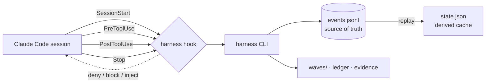

<!-- LANG-SWITCH -->
[English](README.md) · **한국어** · [日本語](README.ja.md) · [中文](README.zh.md)

# king-wjang-harness

> **AI 에이전트는 어떤 지시든 합리화로 빠져나간다. 하지만 훅은 합리화로 빠져나갈 수 없다.**

AI 코딩 에이전트를 위한 프로세스 규율 — **프롬프트로 권고하지 않고, 훅으로 강제한다.** king-wjang-harness는 **설계 → 구축 → 출하** 수명주기를 *불가침*으로 만든다: 에이전트가 설계 단계에서 소스 코드를 쓰려 하거나, 미정산 작업을 남긴 채 세션을 끝내려 하면 **도구 호출 자체를 물리적으로 거부**한다. 설득도, "잊지 말고 해주세요"도 없다. **모델 바깥에서 도는 결정적 게이트**다.

<sub>훅 + CLI · 진실의 원천인 append-only 이벤트 저널 · 컨텍스트 ~0 토큰 · 옵트인 안 한 프로젝트에선 완전 침묵</sub>

---

## 30초 요약

모든 팀이 AI 에이전트에게 프로세스를 가르친다 — *설계부터 하고, 테스트를 쓰고, 끝내기 전에 작업을 정산하라.* `CLAUDE.md`에, 스킬에, 시스템 프롬프트에 넣는다.

그리고 압박이 오면 모델은 **스스로를 설득해 빠져나간다**: *"이건 간단하니 설계 문서는 건너뛰자."* *"수동으로 이미 테스트했잖아."* 지시는 권고일 뿐이고, 그 지시를 따를지 말지 정하는 건 모델 자신이다 — 판결에 이해관계가 걸린 판사.

**강제의 문제는 더 나은 지시로는 못 고친다.** 모델이 통제하지 못하는 게이트가 필요하다.

king-wjang-harness가 그 게이트다. 에이전트가 **설계 트랙**에서 `src/app.ts`를 편집하려 하면 `PreToolUse` 훅이 `deny`를 반환한다 — 편집은 일어나지 않는다. 미커밋 작업 + 턴 로그 없이 세션을 끝내려 하면 `Stop` 훅이 `block`을 반환한다. 모델은 반환값과 논쟁할 수 없다.

---

## 스킬 vs. 훅 — 무엇이 다른가

이것이 진짜 벤치마크다. "어느 도구가 빠른가"가 아니라 — **규율이 스택의 어느 층에 사는가.**

| | 프롬프트 / 스킬 / `CLAUDE.md` <br>*(권고)* | **king-wjang-harness** <br>*(강제)* |
|---|---|---|
| **메커니즘** | 모델이 읽고 *따를지 선택*하는 텍스트 | 훅이 `deny` / `block` 반환 — 모델 **바깥**의 결정 |
| **모델이 무시 가능?** | 예 — 압박받으면 합리화 | **아니오** — 도구 호출이 물리적으로 차단됨 |
| **부하 시 신뢰도** | 가장 필요한 순간에 무너진다 | 일정 — 반환값은 지치지 않는다 |
| **컨텍스트 비용** | 규칙을 더할수록 커진다 | **~0 토큰** — 프로세스 밖에서 실행 |
| **실패 양상** | 조용한 표류; 나중에 발견 | 관측 가능 — 모든 스킵이 흔적을 남김 |
| **상태** | 무상태; 매 세션 재설명 | 내구성 이벤트 저널; `/clear`·재개·머신 교체에도 생존 |

> **경쟁이 아니라 상호보완.** [superpowers](https://github.com/obra/superpowers) 같은 스킬 라이브러리는 모델을 *일하는 방식에서 더 똑똑하게* 만든다. king-wjang-harness는 *프로세스 자체를 불가침으로* 만든다. 둘 다 써라: 스킬은 제안하고, 훅은 처분한다.

**이 주장을 실제로 검증했다.** 같은 과제(하네스 부트스트랩 → UX 증적 게이트를 통과해 웨이브를 완료)를 두 에이전트에게:
- **하네스 안내 없이** → 에이전트가 증적 게이트에 막혀 우회 플래그를 온갖 추측으로 시도하다 **작업을 미완으로 남겼다.**
- **안내와 함께** → 모든 단계를 완료하고 게이트에서 올바로 복구했다.

게이트가 핵심이다. 안내만으로는 통과 못 하고, 강제된 계약이 통과시킨다.

---

## 동작 방식



- **이벤트 저널이 진실의 원천이다.** `.harness/events.jsonl`은 append-only. `state.json`은 *파생 캐시* — 손상되거나 지워지면 하네스가 저널을 재생해 재구성한다. `harness doctor --repair`가 바로 이 일을 한다.
- **세 트랙, 열세 페이즈.** 설계 `P0–P6` · 구축 `P7–P9` · 출하 `P10–P12`.
- **훅 4종, 바이너리 하나:**
  - `SessionStart` — 현재 페이즈, 활성 웨이브, 웨이브 지시서, 최근 턴 로그, 손상 경고를 주입한다. 에이전트가 자기 위치를 정확히 알고 깨어난다.
  - `PreToolUse` — 설계 트랙의 소스 쓰기, 설계 트랙의 배포성 Bash, 그리고 **모든** 페이즈에서 하네스 소유 3파일의 손편집을 거부한다.
  - `PostToolUse` — "실제 작업이 일어남"(쓰기 / 비자기 Bash)을 기록해, Stop 가드가 정산할 턴이 있음을 알게 한다.
  - `Stop` — 활성 웨이브에 작업이 있었는데 턴 로그가 갱신 안 됐으면 세션 종료를 막는다. (명시적 "사소한 턴이었다" 한 줄은 인정되는 탈출구.)
- **웨이브 & 설계 원장.** *웨이브*는 턴 로그와 수용 기준을 가진 작업 단위. *원장*은 버전 있는 설계 노드를 담는다; `node bump`는 바뀐 설계를 참조한 모든 웨이브에 **STALE**을 전파한다 — 낡은 결정 위에 몰래 쌓이는 일이 없다.

---

## 디자인 시스템 & Claude Design 🎨

하네스는 **디자인을 강제되고 버전 관리되는 상태**로 다룬다 — 그리고 Claude Design이 그 시각 프론트엔드다. 일부는 지금 동작하고, 깊은 연동은 다음 마일스톤이다. 정직하게 나눈다.

### 오늘(v0): UX 증적 게이트

`UX-` 노드를 참조하는 웨이브는 `.harness/evidence/<wave-id>/`에 **시각 산출물이 없으면 완료할 수 없다.** Claude Design에서 목업을 프롬프트로 뽑아 HTML/PNG로 export하고, 증적 폴더에 떨궈라 — 게이트가 열린다. 목업 없으면 완료 없음. **실제로 그려본 적 없는 UX 기능은 출하할 수 없다.**

### 설계됨(로드맵): 정식 Claude Design 연동

- **캔버스 = 시각 정본.** 아트보드 1 ↔ UX 노드 1 (`"UX-7 결제"`); 캔버스 URL이 설계 원장에 기록된다.
- **`harness design sync`** 가 캔버스를 pull하고 승인 해시와 대조해, 변경 시 **노드 version을 올리고 → STALE을 전파한다.** 캔버스 편집이 *정식 설계 개정*이 된다 — 하류의 모든 구축 웨이브가 자동으로 플래그된다.
- **P4 추출** 은 컴포넌트 인벤토리와 2× 기준 PNG를 캡처해 이후 시각 회귀 리뷰에 쓴다.
- **피드백 루프:** 캔버스 코멘트 스레드를 (`harness gate feedback`) 개정으로 수집한다 — 아이패드에서 "검토 → 코멘트 → 개정 → 재제출" 루프를 채팅 없이.

### 디자인 시스템 규율: 토큰 파일 하나가 톤을 지배한다

**불변식: 제품의 시각적 톤 전체가 토큰 파일 하나의 함수다.**

- 기능 코드에 raw 값 금지 — 시맨틱 토큰만. `text.primary` ✅ · `blue.500` ❌.
- 단일 원천(`design-tokens.json`); CSS 변수·TS 상수·Tailwind config는 전부 *생성물*, 손으로 복제하지 않는다.
- 4계층 시스템 — 토큰 → 프리미티브 → 기본 컴포넌트 → 도메인 컴포넌트 — 각 계층이 `DS-*` 원장 노드이며, 승인 후 디렉토리는 **동결**되어 컴포넌트가 난립하지 못한다.
- **3중 강제:** 린트(raw 값 = CI 레드) + 훅(토큰 파일 밖의 색·간격 리터럴 편집 거부) + **토큰 스왑 드릴**(테마를 갈아끼우고 전 화면 스크린샷 — 하드코딩된 화면만 안 바뀌어 즉시 노출).

> 보상은 이 불변식이다: **파일 하나만 고쳐 제품 전체를 리테마** — 그리고 그걸 약속이 아니라 스크린샷 드릴로 증명한다.

---

## 보증 (실제로 지키는 불변식)

- **비간섭** — `.harness/` 디렉토리가 *없는* 프로젝트에선 모든 훅이 침묵을 반환한다. 전역 설치는 무위험이며, **프로젝트별로** `harness init` 이후에만 활성화된다.
- **무해** — 훅은 **세션을 절대 깨지 않는다.** 모든 내부 실패는 `exit 0`으로 흡수되고 기록된다. 판정이 깨지면 침묵으로 강등될 뿐, 죽은 세션이 되지 않는다.
- **결정성** — 어떤 판정 경로에도 벽시계·난수가 없다. 같은 입력 → 같은 판정, 매 실행. (동일 테스트 3회 실행으로 검증.)
- **관측 가능한 fail-open** — 하네스가 침묵할 때는 `.harness/.runtime/hook-errors.log`에 흔적을 남긴다; `harness doctor`가 그 줄 수를 세어 노출한다. 관측되지 않는 fail-open은 없느니만 못하다.
- **주입 방어** — 웨이브 frontmatter와 턴 로그 본문(*이전* 세션이 쓴 것)은 신뢰 경계 밖 입력이다. 지시 채널에 들어가기 전 중화된다 — 개행 무력화, 제어문자 제거, 발췌는 내용 해시 nonce 펜스로 감싸 위조된 로그가 펜스를 뚫고 하네스 지시로 위장하지 못하게 한다.
- **자체완결** — 빌드본 `core/dist/`가 커밋돼 있어 순수 클론이 빌드 단계 없이 동작한다. `yaml`은 인라인 번들. `npm audit --omit=dev`: **취약점 0.**

### 실측

| 지표 | 값 |
|---|---|
| 훅 지연 (p95) | **< 150 ms** (실측 62 ms · 10만 건 저널 재생 폴백에서 102 ms) |
| 테스트 스위트 | **893 passing** (33 파일) |
| 세션당 추가 컨텍스트 | 하네스가 켜졌을 때 **~240 토큰** · `.harness/` 없는 프로젝트는 **0** |
| 런타임 의존성 | **1** (`yaml`, 번들) |
| 결정성 | 3× 실행 동일 판정 |

---

## 누구를 위한 것인가

- *코드보다 설계 먼저*가 실제로 일어나길 원하는 팀 — 적어두기만 하는 게 아니라.
- 테스트 실행·작업 정산·기록을 "잊는" 에이전트에 지친 사람.
- 시각 증적과 함께 출하해야 하는 UX 작업 (하네스가 웨이브 완료를 그것으로 게이팅).
- **세션 핸드오프**가 중요한 장기 프로젝트 — 저널이 기억이라, 새 세션(또는 다른 머신)이 직전이 멈춘 곳에서 정확히 이어받는다.

---

## 빠른 시작

### 설치 (Claude Code 플러그인으로)

```bash
claude plugin marketplace add <this-repo>
claude plugin install king-wjang-harness@king-wjang-harness
```

플러그인이 훅 4종을 자동 배선한다. 커밋된 `core/dist/` 덕에 클론만으로 동작한다 — **빌드 단계 불필요.**

<details>
<summary>또는 소스에서 (개발)</summary>

```bash
npm install          # prepare 훅이 tsup으로 core/dist 빌드
./bin/harness --version
```
</details>

### 사용법 — 사용자 자리에서

**대부분 그냥 프롬프트만 날리면 된다.** 하네스는 에이전트를 *통해* 동작한다: CLI는 에이전트가 대신 몰고, 규칙은 훅이 강제한다. 명령을 외울 필요 없다.

```
당신:   "로그인 기능 만들자."
에이전트: (설계 트랙 P0 확인) 설계 노드 등록, 웨이브 생성, 설계 문서 작성 —
         하지만 아직 src/는 못 건드림(훅이 거부).
         "설계 초안 나왔습니다. 봐주세요."
당신:   "좋아, 구축 진행해."
에이전트: 구축 트랙으로 넘어가 src/ 구현, 끝내기 전 턴 로그 정산.
```

당신의 능동적 역할은 **결정 지점**에 있다: 설계 승인, 설계→구축 전환 시점 판단. *어떻게*(CLI 배관과 규칙 준수)는 에이전트와 훅의 몫이다.

> 터미널과 Claude 데스크톱 앱에서 동일하게 동작한다 — 같은 엔진, 같은 훅.

### 명령 레퍼런스

| 명령 | 하는 일 |
|---|---|
| `harness init` | `.harness/` 상태 저장소 생성 (여기서 훅 활성화) |
| `harness status` | 현재 상태 JSON |
| `harness phase set <P0..P12>` | 페이즈 전환 — **승인된 게이트만 다음 페이즈를 연다** |
| `harness node upsert --id <id> --title <t> [--status …]` | 설계 원장 노드 upsert |
| `harness node bump <id>` | 노드 개정 → `version++`, 참조 웨이브에 STALE 전파 |
| `harness wave create [--milestone m] [--goal g] [--refs a,b] [--accept c]` | 웨이브 생성 → id 출력 |
| `harness wave activate <wave-id>` | 웨이브 활성화 |
| `harness wave update "<한 일 / 다음>"` | 턴 로그 정산 |
| `harness wave complete` | 웨이브 완료 (UX 참조 웨이브는 시각 증적 필요) |
| `harness backtrack <phase> --reason "…"` | 나중 트랙에서 설계로 공식 역행 |
| `harness doctor [--repair [--force]] [--accept-policy]` | 무결성 검사 · 저널 재생 복구 · 정책 변경 탐지 (`--accept-policy` 는 `HARNESS_ACCEPT_POLICY=1` 필요 — 사람만) |

`harness --help`가 명령 지도를, `harness <군> --help`가 그 군의 하위명령을 보여준다; 이 표는 짧은 레퍼런스다. 훅 이벤트(`harness hook …`)는 플러그인이 호출하며, 손으로 칠 일 없다.

---

## 상태 & 로드맵

**v0 — 코어 엔진·게이트·구축/출하 트랙까지 구현·실측 완료** (893 tests). 다만 출하 검증 판정은
아직 **출하 불가**다 — 무엇이 열려 있는지는 아래 「알려진 한계」를 보라.

- ✅ 이벤트 저널, 상태 재생, doctor 복구
- ✅ 훅 4종: 세션 주입, 설계 트랙 거부, 활동 추적, stop 정산
- ✅ 웨이브 수명주기, STALE 전파 설계 원장, UX 증적 게이트
- ✅ 주입 방어, 비간섭·무해 불변식, 커밋된 자체완결 dist
- ✅ 승인 **게이트** (`gate submit/approve/verify/sweep/feedback`) + 산출물 레지스트리 (`doc`) + RTM (`report rtm`)
- ✅ **설계 트랙 스킬** (P0–P6, P10–P12) + researcher / design-auditor / wave-executor / wave-verifier / readiness-auditor 에이전트 + ADR (`adr`)
- ✅ **디자인 서브시스템** — `design link/sync/baseline/html`, 인터랙티브 HTML 정본, 토큰 파이프라인 (`tokens gen/lint/swap`)
- ✅ **구축·출하 트랙** — 스택 프로파일(`profile`), 웨이브 루프(`loop`), 시각 증적(`evidence`), 출하 대장·판정(`ship`)

### 알려진 한계 (실측 · 아직 열려 있음)

- `verifying-production-readiness` 스킬은 **부르지만 동봉하지 않는다** — 따로 설치해야 한다.
- **레이아웃 템플릿 선언 강제가 코어에 없다** — 디자인 시스템은 토큰·동결 경로만 본다.
- `/remote-control` 은 **이 플러그인이 제공하지 않는다** — 세션 안내는 지시가 아니라 조건부 안내다.
- **P7~P9(구축 트랙) 스킬이 없다** — 에이전트는 있고 페이즈 매뉴얼만 없다.
- 게이트는 필러 문서를 통과시킨다 — 내용의 **질** 판정은 결정적 로컬 코어 밖이라 사람 승인이 방어다.
- 사람이 `.harness/events.jsonl` 을 손으로 고치는 것은 **위협 모델 밖**이다 — 훅은 에이전트를 막지 주인을 막지 않는다.
- 훅은 **해석할 수 있는 것까지** 본다 — `sh -c`, 깊이 3까지의 스크립트, `npm run` 스크립트. **`make <타깃>` 은 해석하지 않고**(Makefile 문법은 범위 밖), 깊이 4 이상의 스크립트 사슬도 따라가지 않는다.
- **저널 압축 명령은 의도적으로 두지 않는다.** `events.jsonl` 은 감사 기록이라 그것을 다시 쓰는 명령은 **아무것도 지워서는 안 되는 자리의 삭제 원시연산**이 된다. 없어서 치르는 비용은 한계가 분명하다 — 10만 건(수십 년 분) 재생 p95 ≈ 101ms 이고, 그나마 상태가 열화된 동안만이며 `doctor --repair` 로 끝난다.

---

## FAQ

**느려지지 않나?** 훅당 150ms 미만이고, 규칙을 실제로 넘을 때만 개입한다. 사소한 턴은 stop 가드조차 발동 안 한다(활성 웨이브가 있을 때만 무장).

**차단에 동의 못 하면?** 설계는 *벽이 아니라 과속방지턱*이다. Stop 가드는 명시적 "이 턴은 사소했다" 보고를 받아준다; 설계/출하 분리는 공식 `backtrack`으로 넘는다. 훅은 보안 경계가 아니라 사고 방지 장치다.

**내 다른 프로젝트를 건드리나?** 아니다. `.harness/` 없으면 모든 훅이 침묵한다. 프로젝트별 옵트인이다.

**`.harness/state.json`을 손편집해도 되나?** 안 된다 — 훅이 막는다. 저널이 진실이고, 손편집은 상태를 어긋나게 한다. `harness` 명령(또는 `harness doctor --repair`)을 써라.

---

## 라이선스 & 저자

**장욱 (Wook Jang)** 작성. 라이선스 조건은 저장소 참조.

<sub>설계 → 구축 → 출하 규율로 만들어졌다 — 자기 자신에 의해 강제되며.</sub>
