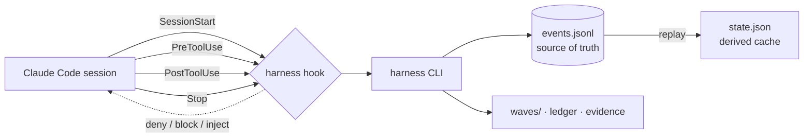

<!-- LANG-SWITCH -->
**English** · [한국어](README.ko.md) · [日本語](README.ja.md) · [中文](README.zh.md)

# king-wjang-harness

> **Your AI agent can rationalize its way out of any instruction. It can't rationalize its way out of a hook.**

Process discipline for AI coding agents — **enforced by hooks, not suggested by prompts.** king-wjang-harness makes the **Design → Build → Ship** lifecycle *inviolable*: it physically denies the tool call when your agent tries to write source code during design, or end a session with work left unsettled. No persuasion. No "please remember to." A deterministic gate that runs **outside the model**.

<sub>Hooks + CLI · append-only event journal as source of truth · ~240 context tokens per session · silent in projects that don't opt in</sub>

---

## The 30-second pitch

Every team teaches their AI agent a process — *design first, write the test, settle your work before you stop.* They put it in `CLAUDE.md`, in a skill, in the system prompt.

And then, under pressure, the model **talks itself out of it**: *"This change is simple, I'll skip the design doc."* *"I already tested it manually."* Instructions are advisory, and the model is the one deciding whether to follow them — a judge with a stake in the verdict.

**You cannot fix an enforcement problem with better instructions.** You need a gate the model does not control.

king-wjang-harness is that gate. When your agent is in the **design track** and tries to edit `src/app.ts`, the `PreToolUse` hook returns `deny` — the edit never happens. When it tries to end a session with uncommitted work and no turn log, the `Stop` hook returns `block`. The model can't argue with a return value.

---

## Skills vs. Hooks — why this is different

This is the benchmark that matters. Not "which tool is faster" — **which layer of the stack the discipline lives in.**

| | Prompt / Skill / `CLAUDE.md` <br>*(advisory)* | **king-wjang-harness** <br>*(enforced)* |
|---|---|---|
| **Mechanism** | Text the model reads and *chooses* to follow | Hook returns `deny` / `block` — a decision **outside** the model |
| **Can the model ignore it?** | Yes — rationalizes under pressure | **No** — the tool call is physically stopped |
| **Reliability under load** | Degrades exactly when it matters most | Constant — a return value doesn't get tired |
| **Context cost** | Grows with every rule you add | **flat ~240 tokens/session** — the rules run out of process, so adding one costs nothing |
| **Failure mode** | Silent drift; you find out later | Observable — every skip leaves a trace |
| **State** | Stateless; re-explained each session | Durable event journal; survives `/clear`, resume, machine change |

> **Complementary, not competitive.** Skill libraries like [superpowers](https://github.com/obra/superpowers) make the model *smarter about how to work*. king-wjang-harness makes the *process itself inviolable*. Use both: the skill proposes, the hook disposes.
>
> The `king-wjang-harness` driver skill **checks for these companions and installs the missing ones** — a network action, run through the normal Bash permission layer and pinned to known marketplaces. It is not required: the harness enforces the process with or without them.

**One informal run — not a benchmark.** We tried this once per arm and did not record the methodology (models, exact task text, trial count), so read it as an anecdote, not a measurement: Two agents, same task (bootstrap a harness, drive a wave to completion through a UX evidence gate):
- **Without the harness's guidance** → the agent hit the evidence gate, exhausted guesses for a bypass flag, and **left the work unfinished**.
- **With it** → completed every step, recovered from the gate correctly.

The gate is the point. Guidance alone doesn't clear it; the enforced contract does.

---

## How it works



- **Event journal is the source of truth.** `.harness/events.jsonl` is append-only. `state.json` is a *derived cache* — corrupt or delete it and the harness rebuilds it by replaying the journal. `harness doctor --repair` does exactly this.
- **Three tracks, thirteen phases.** Design `P0–P6` · Build `P7–P9` · Ship `P10–P12`.
- **Four hooks, one binary:**
  - `SessionStart` — injects current phase, active wave, the wave's instructions, recent turn log, and any degradation warnings. Your agent wakes up knowing exactly where it is.
  - `PreToolUse` — denies source writes on the design track, deploy-class Bash on the design track, and hand-edits of the three harness-owned files, in **any** phase.
  - `PostToolUse` — records "real work happened" (writes / non-self Bash), so the Stop guard knows a turn needs settling.
  - `Stop` — blocks session end if there was activity on the active wave but the turn log wasn't updated. (An explicit "this was trivial" one-liner is an accepted escape hatch.)
- **Waves & the design ledger.** A *wave* is a unit of work with a turn log and acceptance criteria. The *ledger* holds design nodes with versions; `node bump` propagates **STALE** to every wave that referenced the changed design — so nothing silently builds on an outdated decision.

---

## Design system & Claude Design 🎨

The harness treats **design as enforced, versioned state** — and Claude Design is its visual front end. Part of this ships today; the deep integration is the next milestone. Here's the honest split.

### Today (v0): the UX evidence gate

A wave that references a `UX-` node **cannot be completed without a visual artifact** in `.harness/evidence/<wave-id>/`. Prompt a mockup in Claude Design, export the HTML/PNG, drop it into the evidence folder — the gate opens. No mockup, no completion. **You can't ship a UX feature that was never actually drawn.**

### Claude Design integration — shipped, canvas fetch driven by the P4 skill

*(This section used to be titled "roadmap". It was wrong in the quiet direction: everything below is implemented and measured. The canvas fetch is not in the core — by design, to keep the enforcement hook local — it lives in the P4 skill, which fetches with WebFetch and hands the body to the core. Under-advertising is a documentation defect too — it just does not complain.)*

- **Canvas = the visual source of truth.** One artboard ↔ one UX node (`"UX-7 Checkout"`); the canvas URL lives in the design ledger. The **core** never fetches over the network (that keeps the enforcement hook local and fast). The **P4 skill** does it for you: it fetches the canvas with WebFetch and hands the body to `harness design sync <UX-x> --from <file>` in one flow — so the agent pulls the canvas while the core stays local.
- **`harness design sync`** pulls the canvas, diffs it against the approved hash, and on change **bumps the node's version → propagates STALE.** A canvas edit becomes a *formal design revision* — every downstream build wave is flagged, automatically.
- **P4 extraction** captures a component inventory and a 2× baseline PNG, later used for visual-regression review.
- **Feedback loop:** canvas comment threads are collected (`harness gate feedback`) into revisions — an iPad "review → comment → revise → resubmit" loop with no chat.

### The design-system discipline: one token file rules the tone

**Invariant: the entire visual tone of the product is a function of a single token file.**

- No raw values in feature code — semantic tokens only. `text.primary` ✅ · `blue.500` ❌.
- One source (`design-tokens.json`); CSS variables, TS constants, and Tailwind config are all *generated*, never hand-copied.
- A four-layer system — tokens → primitives → base components → domain components — where every layer is a `DS-*` ledger node; the directory **freezes** after approval, so components can't sprawl.
- **Triple enforcement** (the hook layer is **off by default** — turn it on in `config.yaml`)**:** lint (a raw value = CI red) + hook (color/spacing literals outside the token file are denied) + a **token-swap drill** (swap the theme, screenshot every screen — only hardcoded screens fail to change, exposing them instantly).

> The payoff is the invariant: **re-theme the entire product by editing one file** — and prove it with a screenshot drill, not a promise.

---

## Guarantees (the invariants we actually hold)

- **Non-interference** — In any project *without* a `.harness/` directory, every hook returns silence — no output, no files, no context tokens. What it does cost is time: a shell gate exits in **~4 ms p95** before Node ever starts. Installing it globally is zero-risk; it activates **per project**, only after `harness init`.
- **Harmless** — A hook **never crashes your session.** Every internal failure is absorbed to `exit 0` and logged. A broken verdict degrades to silence, never to a dead session.
- **Deterministic** — No wall-clock, no randomness in any decision path. Same input → same verdict, every run. (Verified across 3 identical test runs.)
- **Observable fail-open** — When the harness *does* fall silent, it leaves a trace in `.harness/.runtime/hook-errors.log`; `harness doctor` counts and surfaces it. An unobserved fail-open is worse than none.
- **Injection-hardened** — Wave frontmatter and turn-log text (written by *past* sessions) are untrusted input. Before any of it enters an instruction channel, it's sanitized — newlines neutralized, control characters stripped, excerpts wrapped in content-hash nonce fences so a forged log can't break out and impersonate a harness instruction.
- **Self-contained at runtime** — The built `core/dist/` is committed; a plain clone works with no build step. `yaml` is bundled inline — its ISC notice travels inside the bundle — and every runtime entry point resolves to Node built-ins only. `npm audit --omit=dev`: **0 vulnerabilities.** (Scope: `claude plugin install` runs `npm ci --ignore-scripts` inside the plugin cache. This repo ships an `.npmrc` with `omit=dev`, so the dev toolchain no longer lands there: measured **1.3 MB / 10 packages** per version, down from ~81 MB. To run the shipped test suite yourself, opt in with `npm install --include=dev`.)

### Measured

| Metric | Value |
|---|---|
| Hook latency (p95) | Two surfaces, **both printed by `npm run bench:hook`**. *In-process* (the judgement itself, bundle already loaded): **0.9 ms** normally, **18.6 ms** while the journal-replay fallback is active on a 100k-entry (15 MB) journal. *Wall-clock* (what a tool call actually waits for), same run: **77 ms** / **102 ms** — of which **40 ms is `node` booting** on that machine. Absolute wall-clock is a property of your machine; the gate is on what the fallback **adds** (+17.7 ms in-process, +24.7 ms wall-clock — threshold 50 ms). |
| Test suite | **1506 tests** (64 files) — **1484 pass in the published package** (the rest check repo-internal documents that ship excluded; measured on `git archive`). Two wall-clock checks report *not measurable*, with the load they saw, instead of a verdict on a busy machine |
| Added context per session | **~240 tokens** when the harness is on; **0** in projects without `.harness/` |
| Runtime dependencies | **1** (`yaml`, bundled) |
| Determinism | identical verdicts across 3× runs |

**Re-measure it yourself** — `npm run bench:hook` ships with the package. It synthesises 100k-entry
journals in three shapes (realistic, corrupted, adversarial), times **both surfaces** — the judgement
in-process and the real hook process end-to-end — and prints your machine's `node` startup floor
alongside, because a large part of any absolute number is that floor and not this tool.

---

## Who it's for

- Teams who want *design-before-code* to actually happen — not just be written down.
- Anyone tired of an agent that "forgets" to run tests, settle work, or record what it did.
- UX work that must ship with visual evidence (the harness gates wave completion on it).
- Long-running projects where **session handoff** matters — the journal is the memory, so a fresh session (or a different machine) picks up exactly where the last one left off.

---

## Quick start

### Install (as a Claude Code plugin)

```bash
claude plugin marketplace add wook8170/king-wjang-harness
claude plugin install king-wjang-harness@king-wjang-harness
```

The plugin auto-wires all four hooks. The committed `core/dist/` means it works on clone — **no build step.**

<details>
<summary>Or from source (development)</summary>

```bash
npm install --include=dev   # .npmrc omits dev deps for installers; prepare hook builds core/dist
./bin/harness --version
```
</details>

### Use it — from the user's seat

**You mostly just send prompts.** The harness works *through* your agent: it drives the CLI for you, and the hooks enforce the rules. You don't memorize commands.

```
You:    "Let's build the login feature."
Agent:  (sees design track P0) registers a design node, opens a wave,
        writes the design docs — but can't touch src/ yet (hook denies it).
        "Design draft is ready. Take a look."
You:    "Looks good — go build it."
Agent:  advances to the build track, implements src/, and settles the
        turn log before ending.
```

Your active role is at the **decision points**: approve the design, decide when to cross from design to build. The *how* — CLI plumbing and rule compliance — is the agent's and the hooks' job.

> Works identically in the terminal and in the Claude desktop app — same engine, same hooks.

### Command reference

**Where `harness` lives.** The CLI ships inside the plugin. Claude Code puts the plugin's `bin/` on
the PATH of the shell your agent runs commands in — so the table below works verbatim there, and
that is where these commands are normally run. Your own terminal does not get that entry; to drive
it by hand, add the installed plugin's `bin/` yourself:

```bash
export PATH="$(ls -d "$HOME"/.claude/plugins/cache/king-wjang-harness/king-wjang-harness/*/bin | tail -1):$PATH"
harness --version
```

| Command | What it does |
|---|---|
| `harness init` | Create the `.harness/` state store (activates the hooks here) |
| `harness status` | Current state as JSON |
| `harness phase set <P0..P12>` | Switch phase — **only an approved gate opens the next one** |
| `harness node upsert --id <id> --title <t> [--status …]` | Upsert a design-ledger node |
| `harness node bump <id>` | Revise a node → `version++`, propagate STALE to referencing waves |
| `harness wave create --goal <g> [--milestone m] [--refs a,b] [--accept c]` | Open a wave → prints its id (`--goal` is required) |
| `harness wave activate <wave-id>` | Activate a wave |
| `harness wave update "<did / next>"` | Settle the turn log |
| `harness wave complete` | Complete a wave (UX-referencing waves require visual evidence) |
| `harness backtrack <phase> --reason "…"` | Officially return to design from a later track |
| `harness doctor [--repair [--force]] [--accept-policy]` | Integrity check · journal-replay recovery · policy-drift check (`--accept-policy` needs `HARNESS_ACCEPT_POLICY=1`, humans only) |

`harness --help` prints the command map and `harness <group> --help` the subcommands of one group; this table is the short reference. Hook events (`harness hook …`) are called by the plugin, never by hand.

**Exit codes.** A release script needs to tell "the product is not ready" apart from "the command
did not run at all" — the two used to share exit `1`.

| Code | Meaning |
|---|---|
| `0` | Success — or the verdict is yes |
| `1` | Usage or environment error (unknown subcommand, no `.harness/` here, missing argument) |
| `2` | **The verdict is no** — `ship verdict` NO-GO · `doctor` found problems · `gate verify` drift · `evidence check` short |

Anything non-zero still fails a `cmd || exit 1` script; what changed is that the two cases are now
distinguishable.

---

### MCP tools — the same engine, without the shell

The plugin also registers an MCP server, so an agent can drive the harness through typed tool calls
instead of `Bash`. The server exposes exactly 16 tools: `harness_status`, `harness_wave_create` /
`_activate` / `_update` / `_complete` / `_list`, `harness_node_upsert` / `_bump`,
`harness_gate_submit` / `_status`, `harness_report_rtm` / `_hub`, `harness_ship_verdict`,
`harness_trace`, `harness_doctor` — plus `harness_gate_approve`, which exists only to refuse and
point you at the terminal.

Two things it deliberately does **not** do: it cannot approve a gate (the final click is always a
human's — that is the design, not an accident), and it cannot set a phase past an unapproved gate. Everything an agent can do through
MCP, it could already do through the CLI — the gates are the same gates.

---

## Configuration — `.harness/config.yaml`

Every key is optional; the defaults below are what you get if the file is missing.
The four `design_*` / `block_raw_values` keys are **the inputs to what the hook blocks** — if a
block feels wrong for your stack, this is the dial, not the source code.

| Key | Default | What it does |
|---|---|---|
| `lang` | `en` | Language of the harness's own messages — CLI, hook JSON, and generated documents. Set `ko` for Korean, or export `HARNESS_LANG=ko` for one run. **MCP tool descriptions, refusals and errors stay English** — measured with `lang: ko` and `HARNESS_LANG=ko` both set, across the tool listing, the gate-approval refusal, and unknown-tool/unknown-input errors. |
| `profile` | `generic` | Which profile supplies `test` / `build` / `deploy` / `e2e` commands. A project-local `.harness/profile/` always wins over the bundled one. |
| `remote_control` | `true` | Whether SessionStart mentions remote control. |
| `terse` | `false` | Shorter hook guidance. |
| `design_allowed_prefixes` | `['.harness/', 'docs/']` | **Where implementation code may be written on the design track.** Source files outside these prefixes are denied until the P6 gate is approved. Config and docs are not blocked by this rule, and neither are files **named** as tests (`*.test.*`, `*_test.*`, `test_*`) — with one exception worth knowing: the profile's declared source paths win over the naming rule, so `src/app.test.ts` is still denied while `test/app.test.ts` passes. |
| `design_blocked_bash` | deploy commands (`npm publish`, `docker push`, `terraform apply`, …) | **Shipping commands that stay blocked** until the shipping track opens. Substring match, so no trailing flags. Your stack's own commands belong in the profile's `deploy_commands`. |
| `design_system_frozen_roots` | `[]` | Directories where design-system files must not change once frozen. |
| `block_raw_values` | `false` | Deny writes that hardcode raw colors/sizes instead of referencing semantic tokens. |

`.harness/config.yaml` is itself a protected file — an agent cannot rewrite it to widen its own
permissions ([SEC-136]); you edit it in your terminal. Run `harness doctor` afterwards: a policy
change is journalled, and accepting it needs `HARNESS_ACCEPT_POLICY=1 harness doctor --accept-policy`.

---

## Status — verified for production

**v0.1.2 — SHIP-READY.** The core engine, all three tracks, and every phase are implemented and
measured (1506 tests) — and then put through the harness's **own** production-readiness gate. The tool
that enforces a ship discipline was held to that discipline, and cleared it.

### How thoroughly it was verified

The `verifying-production-readiness` audit was run against this repo from a **fresh, independent
context** — the auditor is not the implementer — as an **11-axis** sweep that actually *drives the
product end-to-end*, not merely reads it. What it found:

- **13 ship gates → 12 measured PASS** (the 13th, hook latency, re-measures cleanly on an idle machine):
  tests · types · self-contained clone · hook harmlessness · enforcement · the MCP **safety property**
  (a gate cannot be approved without a human at a terminal) · determinism · supply chain
  (`npm audit --omit=dev`: **0**) · secret history (gitleaks, 307 commits: **0**) · CLI contract ·
  observability · packaging.
- **Adversarial hook-bypass sweep — ~40 fresh notations** *beyond* the standing 300+ entry corpus, each
  driven through the real hook: novel source-write forms (`printf` · `dd` · `ex` · `install` ·
  `python3 -c` · `awk -i inplace` · …), core / policy / journal writes, symlink & hardlink TOCTOU,
  journal forgery, `base64 -d | sh`, and nested / array MCP arguments. **Every irreversible target —
  core, policy, state, the event journal — was denied. Zero over-blocks on the "must not block" control
  set.**
- **1506 tests green · `tsc` 0 · deterministic** across repeated runs.

**Verdict: SHIP-READY — no blocking defects.** The one intentional permeability is stated plainly, not
hidden: the design → source separation is a *speed bump, not a security wall* (see **Known limits** and
the **FAQ**). Everything that would be irreversible if it leaked — the journal, the policy file, the
core — is a wall.

> The audit is the same one this plugin ships as a companion discipline. It practises what it enforces:
> the readiness verdict above was produced by running that gate on the harness itself.

### What's built

- ✅ Event journal, state replay, doctor recovery
- ✅ Four hooks: session injection, design-track denial, activity tracking, stop settlement
- ✅ Wave lifecycle, design ledger with STALE propagation, UX evidence gate
- ✅ Injection hardening, non-interference & harmless invariants, committed self-contained dist
- ✅ Approval **gates** (`gate submit/approve/verify/sweep/feedback`) + artifact registry (`doc`) + RTM (`report rtm`)
- ✅ **Phase skills — all thirteen** (P0–P12: design `P0–P6`, build `P7–P9`, ship `P10–P12`) + researcher / design-auditor / wave-executor / wave-verifier / readiness-auditor agents + ADR (`adr`)
- ✅ **Design subsystem** — `design link/sync/baseline/html`, the interactive HTML source-of-truth, and the token pipeline (`tokens gen/lint/swap`)
- ✅ **Build & ship tracks** — stack profiles (`profile`), the wave loop (`loop`), visual evidence (`evidence`), ship ledger and verdict (`ship`)

### Known limits (measured, still open)

- **Arbitrary MCP server schemas cannot all be known.** Tools whose names read as writes (`write`, `edit`, `put`, …) are judged, and every path-shaped argument is checked — but a server that names neither its tool nor its argument that way is outside what the hook can see.
- **Content that arrives from outside can carry an alias the command text never names.** A symlink inside an archive is in neither the command nor the filesystem at the moment of judgment, so the hook cannot see it. An earlier rule that refused writes onto freshly-created paths after an extract, clone or install was **removed**: one extra word defeated it (`mkdir h && tar -xf a.tar -C h && echo x > h/f`), and it blocked ordinary single commands (`git clone <url> y && echo x > y/f`). Closing this belongs to the filesystem layer, not the hook.
- **Hard links that already exist are only checked against the core files.** Creating a new name for a protected file is refused, and an existing alias of `config.yaml`/`state.json`/`events.jsonl` is caught by inode. An alias of a *source* file made before the harness was installed is not — matching every source by inode would cost a directory walk on every write, and a slow verdict is a hook that times out, which is a hook that allows.

- The `verifying-production-readiness` skill is **called but not bundled** — it has to be installed
  separately: `claude plugin marketplace add wook8170/verifying-production-readiness` then
  `claude plugin install verifying-production-readiness@verifying-production-readiness`.
- **Layout-template declaration is not enforced** in the core; the design system checks tokens and frozen roots only.
- `/remote-control` is **not provided by this plugin**; the session hint is conditional guidance, not an instruction.
- A gate measures **amount, not quality**. It refuses text that is not prose, and refuses a submission that brings less than 80 characters the reviewed gates have not already seen — so padding a file, copying one with a character changed, or bolting thin files onto an approved set no longer opens a gate (measured: 13/13 → 0, 1 and 2 openings). What it cannot judge is whether 80 genuinely new characters are *good*; that stays with the human, and the review packet now puts every submitted path and its size in front of them.
- A person editing `.harness/events.jsonl` by hand is **out of the threat model** — the hooks stop the agent, not the owner.
- The hook reads what it can resolve — `sh -c`, scripts up to 3 levels deep, and `npm run` scripts. **`make <target>` is not resolved** (parsing Makefiles is out of scope), and a script chain deeper than 3 levels is **not followed — it is denied**, because not seeing what the last step writes is not the same as it being safe.
- **Interpreter program files are read the same way a shell script is** — when a program is handed to an interpreter as a *file* (`sed -f prog.sed`, `awk -f prog.awk`, `perl x.pl`, `python3 x.py`, `node x.js`, `bun`, `deno run`, `ruby`, `php`, `tclsh`, `lua`, `Rscript`), the hook reads that file and denies it if it writes a harness-owned path. Three bounds are deliberate: a program file **over 64 KB is skipped, not denied** (real bundles are large and hand-written forgers are tiny — a >64 KB forger is the disclosed cost of not blocking `node dist/cli.js`); an **interpreter the hook does not know** (exotic runtimes such as `julia`, `groovy`, `raku`) falls outside the enumerated set; and **a program that assembles a harness-owned path inside the language rather than writing it literally** — string concatenation (`".har" + "ness/…"`), `chr()` / `String.fromCharCode`, or base64 — is not caught by the literal-path check (relative `chdir(".harness")` into a protected directory *is* caught). Closing the interpreter long-tail and in-language obfuscation completely needs filesystem-layer enforcement, not hook body-reading; that is out of scope for the hook.
- **The event journal has no compaction command, by choice.** `events.jsonl` is the audit trail, so a command that rewrites it would be an erase primitive in the one place nothing may be erased. The cost of not having it is bounded: replay at 100k events / 15 MB (decades of use) measured at +17.7 ms p95 in-process (+24.7 ms wall-clock) over the normal path, and only while the state store is degraded — `doctor --repair` ends it.

---

## FAQ

**Does it slow me down?** Single-digit milliseconds of actual work per hook, and it only speaks up when a rule is actually crossed. What you feel is your machine starting `node`, which every Claude Code hook pays. Trivial turns don't even trigger the stop guard (it only arms when a wave is active).

**What if I disagree with a block?** The design is a *speed bump, not a wall.* The Stop guard accepts an explicit "this turn was trivial" report; design/ship separation is crossed with an official `backtrack`. The hooks are an accident-prevention layer, not a security boundary.

**Will it touch my other projects?** No. Without `.harness/`, every hook is silent. It's opt-in per project.

**Can I hand-edit `.harness/state.json`?** Don't — and the hook won't let you. The journal is the truth; hand-edits desync it. Use `harness` commands (or `harness doctor --repair`).

---

## Support

**Something broke?** Start here — these run locally and need no network:

| Symptom | First command |
|---|---|
| A command refused and you don't know why | `harness doctor` — reports drift and damage without changing anything |
| State looks wrong | `harness doctor --repair` — the event journal rebuilds `state.json` |
| A hook did nothing | `.harness/.runtime/hook-errors.log` — hook failures are absorbed to exit 0, so this file is the only place they surface |
| You want to see the whole command map | `harness --help`, then `harness <group> --help` |

**Reporting a bug.** `package.json` carries the repository and `bugs` URLs — open an issue on
GitHub. Include the output of `harness doctor` and your `harness --version`; both are safe to
paste (they contain no file contents).

## License & author

MIT — see [LICENSE](LICENSE). Authored by **장욱 (Wook Jang)**.

<sub>Built with a design → build → ship discipline — enforced by itself.</sub>
