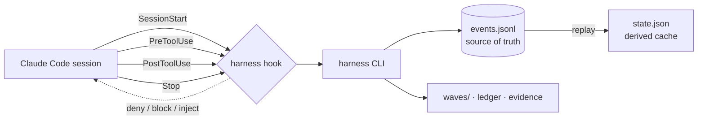

<!-- LANG-SWITCH -->
**English** · [한국어](README.ko.md) · [日本語](README.ja.md) · [中文](README.zh.md)

# king-wjang-harness

> **Your AI agent can rationalize its way out of any instruction. It can't rationalize its way out of a hook.**

Process discipline for AI coding agents — **enforced by hooks, not suggested by prompts.** king-wjang-harness makes the **Design → Build → Ship** lifecycle *inviolable*: it physically denies the tool call when your agent tries to write source code during design, or end a session with work left unsettled. No persuasion. No "please remember to." A deterministic gate that runs **outside the model**.

<sub>Hooks + CLI · append-only event journal as source of truth · ~0 context tokens · silent in projects that don't opt in</sub>

---

## The 30-second pitch

Every team teaches their AI agent a process — *design first, write the test, settle your work before you stop.* They put it in `CLAUDE.md`, in a skill, in the system prompt.

And then, under pressure, the model **talks itself out of it**: *"This change is simple, I'll skip the design doc."* *"I already tested it manually."* Instructions are advisory, and the model is the one deciding whether to follow them — a judge with a stake in the verdict.

**You cannot fix an enforcement problem with better instructions.** You need a gate the model does not control.

king-wjang-harness is that gate. When your agent is in the **design track** and tries to edit `src/app.ts`, the `PreToolUse` hook returns `deny` — the edit never happens. When it tries to end a session with uncommitted work and no turn log, the `Stop` hook returns `block`. The model can't argue with a return value.

---

## Skills vs. Hooks — why this is different

This is the benchmark that matters. Not "which tool is faster" — **which layer of the stack the discipline lives in.**

| | Prompt / Skill / `CLAUDE.md` <br>*(advisory)* | **king-wjang-harness** <br>*(enforced)* |
|---|---|---|
| **Mechanism** | Text the model reads and *chooses* to follow | Hook returns `deny` / `block` — a decision **outside** the model |
| **Can the model ignore it?** | Yes — rationalizes under pressure | **No** — the tool call is physically stopped |
| **Reliability under load** | Degrades exactly when it matters most | Constant — a return value doesn't get tired |
| **Context cost** | Grows with every rule you add | **~0 tokens** — runs out of process |
| **Failure mode** | Silent drift; you find out later | Observable — every skip leaves a trace |
| **State** | Stateless; re-explained each session | Durable event journal; survives `/clear`, resume, machine change |

> **Complementary, not competitive.** Skill libraries like [superpowers](https://github.com/obra/superpowers) make the model *smarter about how to work*. king-wjang-harness makes the *process itself inviolable*. Use both: the skill proposes, the hook disposes.

**We tested this claim.** Two agents, same task (bootstrap a harness, drive a wave to completion through a UX evidence gate):
- **Without the harness's guidance** → the agent hit the evidence gate, exhausted guesses for a bypass flag, and **left the work unfinished**.
- **With it** → completed every step, recovered from the gate correctly.

The gate is the point. Guidance alone doesn't clear it; the enforced contract does.

---

## How it works



- **Event journal is the source of truth.** `.harness/events.jsonl` is append-only. `state.json` is a *derived cache* — corrupt or delete it and the harness rebuilds it by replaying the journal. `harness doctor --repair` does exactly this.
- **Three tracks, thirteen phases.** Design `P0–P6` · Build `P7–P9` · Ship `P10–P12`.
- **Four hooks, one binary:**
  - `SessionStart` — injects current phase, active wave, the wave's instructions, recent turn log, and any degradation warnings. Your agent wakes up knowing exactly where it is.
  - `PreToolUse` — denies source writes on the design track, deploy-class Bash on the design track, and hand-edits of the three harness-owned files, in **any** phase.
  - `PostToolUse` — records "real work happened" (writes / non-self Bash), so the Stop guard knows a turn needs settling.
  - `Stop` — blocks session end if there was activity on the active wave but the turn log wasn't updated. (An explicit "this was trivial" one-liner is an accepted escape hatch.)
- **Waves & the design ledger.** A *wave* is a unit of work with a turn log and acceptance criteria. The *ledger* holds design nodes with versions; `node bump` propagates **STALE** to every wave that referenced the changed design — so nothing silently builds on an outdated decision.

---

## Design system & Claude Design 🎨

The harness treats **design as enforced, versioned state** — and Claude Design is its visual front end. Part of this ships today; the deep integration is the next milestone. Here's the honest split.

### Today (v0): the UX evidence gate

A wave that references a `UX-` node **cannot be completed without a visual artifact** in `.harness/evidence/<wave-id>/`. Prompt a mockup in Claude Design, export the HTML/PNG, drop it into the evidence folder — the gate opens. No mockup, no completion. **You can't ship a UX feature that was never actually drawn.**

### Claude Design integration — shipped, except the network pull

*(This section used to be titled "roadmap". It was wrong in the quiet direction: everything below except the automatic canvas fetch is implemented and measured. Under-advertising is a documentation defect too — it just does not complain.)*

- **Canvas = the visual source of truth.** One artboard ↔ one UX node (`"UX-7 Checkout"`); the canvas URL lives in the design ledger. **Not shipped:** fetching the canvas over the network — `harness design sync <UX-x> --from <file>` takes content you exported yourself.
- **`harness design sync`** pulls the canvas, diffs it against the approved hash, and on change **bumps the node's version → propagates STALE.** A canvas edit becomes a *formal design revision* — every downstream build wave is flagged, automatically.
- **P4 extraction** captures a component inventory and a 2× baseline PNG, later used for visual-regression review.
- **Feedback loop:** canvas comment threads are collected (`harness gate feedback`) into revisions — an iPad "review → comment → revise → resubmit" loop with no chat.

### The design-system discipline: one token file rules the tone

**Invariant: the entire visual tone of the product is a function of a single token file.**

- No raw values in feature code — semantic tokens only. `text.primary` ✅ · `blue.500` ❌.
- One source (`design-tokens.json`); CSS variables, TS constants, and Tailwind config are all *generated*, never hand-copied.
- A four-layer system — tokens → primitives → base components → domain components — where every layer is a `DS-*` ledger node; the directory **freezes** after approval, so components can't sprawl.
- **Triple enforcement:** lint (a raw value = CI red) + hook (color/spacing literals outside the token file are denied) + a **token-swap drill** (swap the theme, screenshot every screen — only hardcoded screens fail to change, exposing them instantly).

> The payoff is the invariant: **re-theme the entire product by editing one file** — and prove it with a screenshot drill, not a promise.

---

## Guarantees (the invariants we actually hold)

- **Non-interference** — In any project *without* a `.harness/` directory, every hook returns silence. Installing it globally is zero-risk; it activates **per project**, only after `harness init`.
- **Harmless** — A hook **never crashes your session.** Every internal failure is absorbed to `exit 0` and logged. A broken verdict degrades to silence, never to a dead session.
- **Deterministic** — No wall-clock, no randomness in any decision path. Same input → same verdict, every run. (Verified across 3 identical test runs.)
- **Observable fail-open** — When the harness *does* fall silent, it leaves a trace in `.harness/.runtime/hook-errors.log`; `harness doctor` counts and surfaces it. An unobserved fail-open is worse than none.
- **Injection-hardened** — Wave frontmatter and turn-log text (written by *past* sessions) are untrusted input. Before any of it enters an instruction channel, it's sanitized — newlines neutralized, control characters stripped, excerpts wrapped in content-hash nonce fences so a forged log can't break out and impersonate a harness instruction.
- **Self-contained** — The built `core/dist/` is committed; a plain clone works with no build step. `yaml` is bundled inline. `npm audit --omit=dev`: **0 vulnerabilities.**

### Measured

| Metric | Value |
|---|---|
| Hook latency (p95) | **< 150 ms** (measured 62 ms; 102 ms on the journal-replay fallback with a 100k-entry journal) |
| Test suite | **1054 passing** (42 files) |
| Added context per session | **~240 tokens** when the harness is on; **0** in projects without `.harness/` |
| Runtime dependencies | **1** (`yaml`, bundled) |
| Determinism | identical verdicts across 3× runs |

---

## Who it's for

- Teams who want *design-before-code* to actually happen — not just be written down.
- Anyone tired of an agent that "forgets" to run tests, settle work, or record what it did.
- UX work that must ship with visual evidence (the harness gates wave completion on it).
- Long-running projects where **session handoff** matters — the journal is the memory, so a fresh session (or a different machine) picks up exactly where the last one left off.

---

## Quick start

### Install (as a Claude Code plugin)

```bash
claude plugin marketplace add <this-repo>
claude plugin install king-wjang-harness@king-wjang-harness
```

The plugin auto-wires all four hooks. The committed `core/dist/` means it works on clone — **no build step.**

<details>
<summary>Or from source (development)</summary>

```bash
npm install          # prepare hook builds core/dist via tsup
./bin/harness --version
```
</details>

### Use it — from the user's seat

**You mostly just send prompts.** The harness works *through* your agent: it drives the CLI for you, and the hooks enforce the rules. You don't memorize commands.

```
You:    "Let's build the login feature."
Agent:  (sees design track P0) registers a design node, opens a wave,
        writes the design docs — but can't touch src/ yet (hook denies it).
        "Design draft is ready. Take a look."
You:    "Looks good — go build it."
Agent:  advances to the build track, implements src/, and settles the
        turn log before ending.
```

Your active role is at the **decision points**: approve the design, decide when to cross from design to build. The *how* — CLI plumbing and rule compliance — is the agent's and the hooks' job.

> Works identically in the terminal and in the Claude desktop app — same engine, same hooks.

### Command reference

| Command | What it does |
|---|---|
| `harness init` | Create the `.harness/` state store (activates the hooks here) |
| `harness status` | Current state as JSON |
| `harness phase set <P0..P12>` | Switch phase — **only an approved gate opens the next one** |
| `harness node upsert --id <id> --title <t> [--status …]` | Upsert a design-ledger node |
| `harness node bump <id>` | Revise a node → `version++`, propagate STALE to referencing waves |
| `harness wave create [--milestone m] [--goal g] [--refs a,b] [--accept c]` | Open a wave → prints its id |
| `harness wave activate <wave-id>` | Activate a wave |
| `harness wave update "<did / next>"` | Settle the turn log |
| `harness wave complete` | Complete a wave (UX-referencing waves require visual evidence) |
| `harness backtrack <phase> --reason "…"` | Officially return to design from a later track |
| `harness doctor [--repair [--force]] [--accept-policy]` | Integrity check · journal-replay recovery · policy-drift check (`--accept-policy` needs `HARNESS_ACCEPT_POLICY=1`, humans only) |

`harness --help` prints the command map and `harness <group> --help` the subcommands of one group; this table is the short reference. Hook events (`harness hook …`) are called by the plugin, never by hand.

---

## Status & roadmap

**v0 — core engine, gates, and both later tracks are implemented and measured** (1054 tests). The
release-readiness audit is still **not-ready**: see "Known limits" below for what is open.

- ✅ Event journal, state replay, doctor recovery
- ✅ Four hooks: session injection, design-track denial, activity tracking, stop settlement
- ✅ Wave lifecycle, design ledger with STALE propagation, UX evidence gate
- ✅ Injection hardening, non-interference & harmless invariants, committed self-contained dist
- ✅ Approval **gates** (`gate submit/approve/verify/sweep/feedback`) + artifact registry (`doc`) + RTM (`report rtm`)
- ✅ **Design track skills** (P0–P6, P10–P12) + researcher / design-auditor / wave-executor / wave-verifier / readiness-auditor agents + ADR (`adr`)
- ✅ **Design subsystem** — `design link/sync/baseline/html`, the interactive HTML source-of-truth, and the token pipeline (`tokens gen/lint/swap`)
- ✅ **Build & ship tracks** — stack profiles (`profile`), the wave loop (`loop`), visual evidence (`evidence`), ship ledger and verdict (`ship`)

### Known limits (measured, still open)

- The `verifying-production-readiness` skill is **called but not bundled** — it has to be installed separately.
- **Layout-template declaration is not enforced** in the core; the design system checks tokens and frozen roots only.
- `/remote-control` is **not provided by this plugin**; the session hint is conditional guidance, not an instruction.
- **No skills for P7–P9** (the build track) — the agents cover it, the phase manuals do not.
- A gate measures **amount, not quality**. It refuses text that is not prose, and refuses a submission that brings less than 80 characters the reviewed gates have not already seen — so padding a file, copying one with a character changed, or bolting thin files onto an approved set no longer opens a gate (measured: 13/13 → 0, 1 and 2 openings). What it cannot judge is whether 80 genuinely new characters are *good*; that stays with the human, and the review packet now puts every submitted path and its size in front of them.
- A person editing `.harness/events.jsonl` by hand is **out of the threat model** — the hooks stop the agent, not the owner.
- The hook reads what it can resolve — `sh -c`, scripts up to 3 levels deep, and `npm run` scripts. **`make <target>` is not resolved** (parsing Makefiles is out of scope), and a 4-level script chain is not followed.
- **The event journal has no compaction command, by choice.** `events.jsonl` is the audit trail, so a command that rewrites it would be an erase primitive in the one place nothing may be erased. The cost of not having it is bounded: replay at 100k events (decades of use) measured p95 ≈ 101ms, and only while the state store is degraded — `doctor --repair` ends it.

---

## FAQ

**Does it slow me down?** Sub-150ms per hook, and it only speaks up when a rule is actually crossed. Trivial turns don't even trigger the stop guard (it only arms when a wave is active).

**What if I disagree with a block?** The design is a *speed bump, not a wall.* The Stop guard accepts an explicit "this turn was trivial" report; design/ship separation is crossed with an official `backtrack`. The hooks are an accident-prevention layer, not a security boundary.

**Will it touch my other projects?** No. Without `.harness/`, every hook is silent. It's opt-in per project.

**Can I hand-edit `.harness/state.json`?** Don't — and the hook won't let you. The journal is the truth; hand-edits desync it. Use `harness` commands (or `harness doctor --repair`).

---

## Support

**Something broke?** Start here — these run locally and need no network:

| Symptom | First command |
|---|---|
| A command refused and you don't know why | `harness doctor` — reports drift and damage without changing anything |
| State looks wrong | `harness doctor --repair` — the event journal rebuilds `state.json` |
| A hook did nothing | `.harness/.runtime/hook-errors.log` — hook failures are absorbed to exit 0, so this file is the only place they surface |
| You want to see the whole command map | `harness --help`, then `harness <group> --help` |

**Reporting a bug.** This plugin has no public issue tracker yet — it is distributed
from the repository you installed it from, so report through that channel. Include
the output of `harness doctor` and your `harness --version`; both are safe to paste
(they contain no file contents).

## License & author

MIT — see [LICENSE](LICENSE). Authored by **장욱 (Wook Jang)**.

<sub>Built with a design → build → ship discipline — enforced by itself.</sub>
