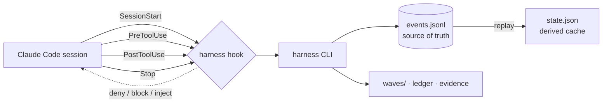

<!-- LANG-SWITCH -->
[English](README.md) · [한국어](README.ko.md) · [日本語](README.ja.md) · **中文**

# king-wjang-harness

> **你的 AI 智能体能为任何指令找到借口——但对钩子（hook），它无计可施。**

为 AI 编码智能体提供流程纪律 —— **由钩子强制执行，而非由提示词建议。** king-wjang-harness 让 **设计 → 构建 → 出货** 生命周期*不可侵犯*：当你的智能体试图在设计阶段编写源代码，或是在工作尚未结算的情况下结束会话，它会**物理性地拒绝该工具调用**。没有说服，没有"请记得要……"。这是一道**在模型之外运行**的确定性关卡。

<sub>钩子 + CLI · 仅追加（append-only）的事件日志作为唯一真相源 · 上下文开销约 0 令牌 · 未启用的项目中保持完全静默</sub>

---

## 30 秒说清楚

每个团队都会教自己的 AI 智能体一套流程 —— *先设计，再写测试，收尾前先结算工作。* 他们把它写进 `CLAUDE.md`，写进技能（skill），写进系统提示词里。

然后，一旦有压力，模型就会**给自己找借口开脱**：*"这个改动很简单，我跳过设计文档吧。"* *"我已经手动测试过了。"* 指令终究只是建议，而是否遵守由模型自己决定——这就好比让一个与判决结果有利害关系的人来当法官。

**执行力问题无法靠更好的指令来解决。** 你需要一道模型无法掌控的关卡。

king-wjang-harness 就是这道关卡。当你的智能体处于**设计轨道**却试图编辑 `src/app.ts` 时，`PreToolUse` 钩子会返回 `deny`——编辑根本不会发生。当它试图在有未提交改动、且轮次日志未更新的情况下结束会话时，`Stop` 钩子会返回 `block`。模型没法跟一个返回值争辩。

---

## 技能 vs. 钩子 —— 为什么这不一样

这才是真正重要的评判标准。不是"哪个工具更快"，而是**纪律到底活在技术栈的哪一层。**

| | 提示词 / 技能 / `CLAUDE.md`<br>*(建议性)* | **king-wjang-harness**<br>*(强制性)* |
|---|---|---|
| **机制** | 模型读到后*自行选择*是否遵守的文本 | 钩子返回 `deny` / `block`——一个在模型**之外**做出的决定 |
| **模型能忽略它吗？** | 能——一旦有压力就会给自己找借口 | **不能**——工具调用被物理性地拦停 |
| **承压时的可靠性** | 偏偏在最要命的时候掉链子 | 恒定——返回值不会疲劳 |
| **上下文开销** | 每加一条规则就多一份开销 | **约 0 令牌**——在进程之外运行 |
| **失效模式** | 悄无声息地跑偏，事后才发现 | 可观测——每一次跳过都留下痕迹 |
| **状态** | 无状态，每个会话都要重新说明一遍 | 持久化的事件日志；跨越 `/clear`、恢复会话、更换机器依然有效 |

> **二者互补，而非竞争。** 像 [superpowers](https://github.com/obra/superpowers) 这样的技能库让模型*更懂得如何做事*；king-wjang-harness 则让*流程本身不可侵犯*。两者一起用：技能负责提议，钩子负责拍板。

**我们验证过这个说法。** 两个智能体执行同一个任务（初始化一个 harness，把一个波次推进到完成，途中经过一个 UX 证据关卡）：
- **没有 harness 的引导** → 智能体撞上了证据关卡，把能想到的绕过标志都试了个遍，**最终没能完成工作**。
- **有 harness** → 顺利完成每一步，正确地从关卡中恢复。

关卡才是关键。光靠引导过不了关；靠的是被强制执行的契约。

---

## 工作原理



- **事件日志是唯一真相源。** `.harness/events.jsonl` 是仅追加（append-only）的。`state.json` 是一份*派生缓存*——把它弄坏或删掉，harness 会通过重放日志把它重建出来。`harness doctor --repair` 做的正是这件事。
- **三条轨道，十三个阶段。** 设计 `P0–P6` · 构建 `P7–P9` · 出货 `P10–P12`。
- **四个钩子，一个二进制程序：**
  - `SessionStart` —— 注入当前阶段、活跃波次、该波次的指示、最近的轮次日志，以及任何降级警告。你的智能体一醒来就清楚自己身处何处。
  - `PreToolUse` —— 在设计轨道上拒绝源代码写入、拒绝设计轨道上的部署类 Bash 命令，并且在**任意**阶段拒绝对三个 harness 自有文件的手工编辑。
  - `PostToolUse` —— 记录"发生了实际工作"（写入操作 / 非自身触发的 Bash），这样 Stop 守卫就知道这一轮需要结算。
  - `Stop` —— 如果活跃波次上有活动，但轮次日志没有更新，就阻止会话结束。（一句明确的"这轮是琐碎小事"说明，是被接受的逃生出口。）
- **波次与设计台账。** *波次* 是一个带有轮次日志和验收标准的工作单元。*台账* 保存带版本号的设计节点；`node bump` 会把 **STALE** 传播给所有引用了该设计的波次——这样就不会有任何东西悄悄地建立在过时的决策之上。

---

## 设计系统与 Claude Design 🎨

harness 把**设计当作被强制执行、有版本的状态**来对待——而 Claude Design 就是它的可视化前端。其中一部分今天已经交付；深度集成是下一个里程碑。以下是如实的划分。

### 今天（v0）：UX 证据关卡

一个引用了 `UX-` 节点的波次，**如果 `.harness/evidence/<wave-id>/` 中没有视觉制品，就无法完成**。在 Claude Design 中生成一份原型稿，导出 HTML/PNG，放进证据文件夹——关卡就打开了。没有原型稿，就不能完成。**没有真正画出来的 UX 功能，就没法出货。**

### 设计中（路线图）：一等公民级的 Claude Design 集成

- **画布（Canvas）= 可视化的唯一真相源。** 一块画板 ↔ 一个 UX 节点（`"UX-7 Checkout"`）；画布 URL 保存在设计台账里。
- **`harness design sync`** 拉取画布，与已批准的哈希值做差异比对，一旦发生变化就**提升该节点的版本号 → 传播 STALE。** 一次画布编辑就变成了一次*正式的设计修订*——每一个下游构建波次都会被自动标记。
- **P4 提取**会采集组件清单和一张 2× 基线 PNG，供之后的视觉回归审查使用。
- **反馈闭环：** 画布上的评论串会被收集（`harness gate feedback`）并汇入修订记录——形成一个无需聊天、在 iPad 上"审阅 → 评论 → 修订 → 重新提交"的闭环。

### 设计系统纪律：一份令牌文件统领全局基调

**不变量：产品的整体视觉基调，是一份单一令牌文件的函数。**

- 功能代码中不允许出现原始值——只能使用语义化令牌。`text.primary` ✅ · `blue.500` ❌。
- 单一数据源（`design-tokens.json`）；CSS 变量、TS 常量、Tailwind 配置全部由它*生成*，绝不手工复制。
- 一套四层体系——令牌 → 原语 → 基础组件 → 领域组件——每一层都是一个 `DS-*` 台账节点；目录在获批后会**冻结**，组件因此无法无序蔓延。
- **三重强制：** lint（出现原始值 = CI 变红）+ 钩子（令牌文件之外的颜色/间距字面量会被拒绝）+ **令牌替换演练**（切换主题，为每个界面截图——只有硬编码的界面不会随之变化，从而当场暴露）。

> 回报就是这条不变量：**只需编辑一个文件，就能给整个产品换肤**——而且是用截图演练来证明，而不是靠嘴上承诺。

---

## 保证（我们实际持有的不变量）

- **互不干扰** —— 在任何*没有* `.harness/` 目录的项目中，每个钩子都保持静默返回。全局安装它是零风险的；它**按项目**激活，且只在执行 `harness init` 之后才会激活。
- **无害** —— 钩子**绝不会让你的会话崩溃。** 每一个内部错误都会被吸收为 `exit 0` 并记录下来。一个失效的判定会降级为静默，而不会导致会话卡死。
- **确定性** —— 任何决策路径中都没有挂钟时间，也没有随机性。相同输入 → 相同判定，每次运行皆然。（已在 3 次相同的测试运行中验证。）
- **可观测的 fail-open** —— 当 harness *确实*陷入静默时，它会在 `.harness/.runtime/hook-errors.log` 中留下痕迹；`harness doctor` 会统计并呈现它。一个无法被观测到的 fail-open，比根本没有还糟糕。
- **抗注入加固** —— 波次的 frontmatter 和轮次日志文本（由*过去*的会话写入）都被视为不可信输入。在其中任何内容进入指令通道之前，都会先经过净化——换行符被中和、控制字符被剥离、摘录会被包裹在基于内容哈希的一次性围栏中，这样一份伪造的日志就无法跳脱出来冒充 harness 的指令。
- **自包含** —— 构建产物 `core/dist/` 已被提交；直接克隆即可使用，无需任何构建步骤。`yaml` 被内联打包在内。`npm audit --omit=dev`：**0 个漏洞。**

### 实测数据

| 指标 | 数值 |
|---|---|
| 钩子延迟（p95） | **< 150 ms**（实测约 57–104 ms） |
| 测试套件 | **198 项通过** |
| 每会话新增上下文 | **约 0 令牌** |
| 运行时依赖 | **1 个**（`yaml`，已打包） |
| 确定性 | 3 次运行判定完全一致 |

---

## 适用对象

- 希望*先设计后编码*真正落地——而不只是写在文档里——的团队。
- 厌倦了智能体"忘记"跑测试、结算工作、记录自己做过什么的人。
- 必须附带视觉证据才能出货的 UX 工作（harness 会以此作为波次完成的关卡条件）。
- 看重**会话交接**的长期项目——日志就是记忆，因此一个全新的会话（或换一台机器）也能精确接续上一个会话停下的地方。

---

## 快速开始

### 安装（作为 Claude Code 插件）

```bash
claude plugin marketplace add <this-repo>
claude plugin install king-wjang-harness@king-wjang-harness
```

该插件会自动接好全部四个钩子。已提交的 `core/dist/` 意味着克隆下来即可直接使用——**无需构建步骤。**

<details>
<summary>或从源码安装（开发模式）</summary>

```bash
npm install          # prepare hook builds core/dist via tsup
./bin/harness --version
```
</details>

### 使用方法 —— 站在用户的角度

**你大部分时候只需要发提示词。** harness 是*通过*你的智能体来工作的：它替你驱动 CLI，钩子负责强制执行规则。你不需要背命令。

```
你:     "我们来做登录功能吧。"
智能体: (确认处于设计轨道 P0) 注册一个设计节点、开启一个波次、
        撰写设计文档 —— 但还不能碰 src/（钩子会拒绝）。
        "设计草稿已就绪，请过目。"
你:     "不错——开始构建吧。"
智能体: 推进到构建轨道，实现 src/，并在结束前结算轮次日志。
```

你的能动角色体现在**决策点**上：批准设计、判断何时从设计跨入构建。至于*怎么做*——CLI 的具体操作与规则遵守——是智能体和钩子的事。

> 在终端和 Claude 桌面应用中表现完全一致——同一个引擎，同一套钩子。

### 命令参考

| 命令 | 作用 |
|---|---|
| `harness init` | 创建 `.harness/` 状态存储（在此激活钩子） |
| `harness status` | 以 JSON 形式输出当前状态 |
| `harness phase set <P0..P12>` | 切换阶段 *(v0 临时方案 —— 审批关卡即将推出)* |
| `harness node upsert --id <id> --title <t> [--status …]` | 新增或更新一个设计台账节点 |
| `harness node bump <id>` | 修订一个节点 → `version++`，向引用它的波次传播 STALE |
| `harness wave create [--milestone m] [--goal g] [--refs a,b] [--accept c]` | 开启一个波次 → 打印其 id |
| `harness wave activate <wave-id>` | 激活一个波次 |
| `harness wave update "<做了什么 / 下一步>"` | 结算轮次日志 |
| `harness wave complete` | 完成一个波次（引用 UX 的波次需要视觉证据） |
| `harness backtrack <phase> --reason "…"` | 从后续轨道正式退回设计阶段 |
| `harness doctor [--repair [--force]]` | 完整性检查 · 日志重放恢复 |

没有 `--help`；这张表就是参考文档。钩子事件（`harness hook …`）由插件调用，从不需要手动调用。

---

## 状态与路线图

**v0 —— 核心引擎已完成并通过验证**（198 项测试，针对 v0 范围的出货就绪审计已通过）。

- ✅ 事件日志、状态重放、doctor 恢复
- ✅ 四个钩子：会话注入、设计轨道拒绝、活动追踪、停止结算
- ✅ 波次生命周期、带 STALE 传播的设计台账、UX 证据关卡
- ✅ 注入加固、互不干扰与无害不变量、已提交的自包含 dist
- 🔜 审批**关卡**（submit / approve / invalidate + 制品注册表 + RTM），用以取代 `phase set` 这一临时方案
- 🔜 **设计轨道技能**（P0–P6）+ researcher / design-auditor 智能体 + ADR 决策点
- 🔜 **设计子系统** —— Claude Design 同步、作为唯一真相源的交互式 HTML、以及单一令牌管线（参见"设计系统与 Claude Design"一节）
- 🔜 **构建与出货轨道** —— 技术栈画像（stack profiles）、带 executor/verifier 的波次循环、视觉证据 + 令牌替换演练、以及就绪度审计
- 🔜 已吸收的工具（token-guard、auto-retry）、terse 模式、trace

---

## 常见问题

**它会拖慢我的速度吗？** 每个钩子耗时不到 150ms，而且只有在规则真正被触及时才会发声。琐碎的轮次甚至不会触发 Stop 守卫（它只在有活跃波次时才会启动）。

**如果我不认同某次拦截怎么办？** 这里的设计理念是*减速带，而不是围墙。* Stop 守卫会接受一句明确的"这一轮是琐碎小事"的说明；设计/出货的分界则通过正式的 `backtrack` 来跨越。这些钩子是一层事故预防机制，而不是安全边界。

**它会影响我的其他项目吗？** 不会。没有 `.harness/`，每个钩子都保持静默。它是按项目自愿启用的。

**我可以手动编辑 `.harness/state.json` 吗？** 不要这样做——而且钩子也不会允许你这样做。日志才是真相；手工编辑会让状态失步。请使用 `harness` 命令（或 `harness doctor --repair`）。

---

## 许可证与作者

由 **장욱 (Wook Jang)** 编写。许可证条款见代码仓库。

<sub>以设计 → 构建 → 出货的纪律打造而成——由它自身强制执行。</sub>
